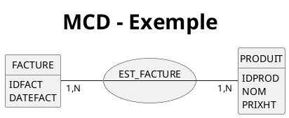
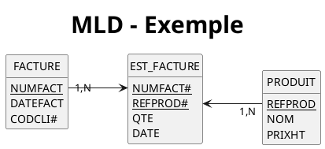

# La Méthode MERISE

> MERISE est une méthode d’analyse et de conceptualisation.
{.is-success}

## Historique

Née dans les années 70, développée initialement par Hubert Tardieu. Elle fut ensuite mise en avant dans les années 80, à la demande du ministère de l'Industrie qui souhaitait une méthode de conception des SI (Systèmes d'Informations).

## Définitions
Le système d'information ou SI, peut être défini comme étant l'ensemble des moyens humains, matériels et immatériels mis en œuvre afin de gérer l'information au sein d'une unité, une entreprise par exemple.

Le SI possède quatre fonctions essentielles :
- la saisie ou collecte de l'information ;
- la mémorisation de l'information à l'aide de fichier ou de base de données ;
- le traitement de l'information afin de mieux l'exploiter (consultation, organisation, mise à jour, calculs pour obtenir de nouvelles données…) ;
- la diffusion de l'information.
Autrefois, l'information était stockée sur papier à l'aide de formulaires, de dossiers… et il existait des procédures manuelles pour la traiter. Aujourd'hui, les systèmes informatisés, comme les systèmes de gestion de bases de données relationnelles (SGBDR), sont mis au service du système d'information.

**MERISE** est donc une méthode d'analyse et de conception des SI basée sur le principe de la séparation des données et des traitements. Elle possède un certain nombre de modèles (ou schémas) qui sont répartis sur trois niveaux :
- le niveau conceptuel ;
- le niveau logique ou organisationnel ;
- le niveau physique.

Ici, nous ne nous intéresserons qu'à certains schémas permettant la conception d'une base de données relationnelle puis sa réalisation sur un SGBDR.

## Les modèles

# Tabs {.tabset}
## MCD

> Le *_**Modèle Conceptuel des Données (MCD)**_* représente vos données de manière schématique, visuelle et abstraite. Il est basé sur deux notions principales : les entités et les associations, d'où sa seconde appellation : le schéma Entité/Association. {.is-success}

L'élaboration du MCD passe par les étapes suivantes :
- la mise en place de règles de gestion (si celles-ci ne vous sont pas données) ;
- l'élaboration du dictionnaire des données ;
- la recherche des dépendances fonctionnelles entre ces données ;
- l'élaboration du MCD (création des entités puis des associations puis ajout des cardinalités).




Ici l'association « EST_FACTURE» traduit les deux règles de gestion suivantes :
Chaque facture peut contenir 1 ou plusieurs produits;
Chaque produit peut être inclus dans 1 ou plusieurs factures.


## MLD

> Le *_**Modèle Logique des Données (MLD)**_* permet de représenter les relations entre les données de manière plus concrète et détaillée. Ainsi le MLD prend en compte la façon dont les données seront stockées et manipulées. Ces relations nous permettront par la suite de créer nos tables au niveau physique. {.is-success}

> Une relation possède un nom qui correspond en général à celui de l'entité ou de l'association qui lui correspond. Elle possède aussi une **clé primaire** qui permet d'identifier sans ambiguïté chaque occurrence de cette relation. La clé primaire peut être composée d'un ou plusieurs attributs. {.is-warning}


Voici un premier exemple de relation (issue de l'entité « FACTURE » de notre précédent MCD) :
Facture (_id_fact_, date_fact, id_cli#)

Légende :
**x** : relation
_x_ : clé primaire
x# : clé étrangère

> Il existe un autre type de clé appelé **clé étrangère**. La clé étrangère est un attribut d'une relation qui fait référence à la clé primaire d'une autre relation (ces deux clés devront donc avoir le même type de données). {.is-warning}

> Par convention, on fait précéder ou suivre la clé étrangère du symbole #. Ceci n'est pas une obligation à partir du moment où les légendes sont suffisamment précises (et obligatoire) {.is-info}


Voici un exemple schématique de notre MLD : 




## MCP

> Le *_**Modèle Physique des Données (MPD)**_* représente tout simplement un ensemble de script SQL basé sur le MCD et le MLD précédent {.is-success}

```=sql
CREATE TABLE facture (
  id_fact INTEGER PRIMARY KEY,
  date_fact DATE NOT NULL,
  id_cli INTEGER NOT NULL,
  FOREIGN KEY (cod_cli) REFERENCES client(id),
);

CREATE TABLE produit (
  id_prod INTEGER PRIMARY KEY,
  nom VARCHAR(255) NOT NULL,
  prix_ht DECIMAL(10,2) NOT NULL
);

CREATE TABLE est_facture (
  id_fact INTEGER NOT NULL,
  id_prod INTEGER NOT NULL,
  qte INTEGER NOT NULL,
  date DATE NOT NULL
  PRIMARY KEY (id_fact, id_prod),
  FOREIGN KEY (id_fact) REFERENCES facture(id_fact),
  FOREIGN KEY (id_prod) REFERENCES produit(id_prod)
);

```
