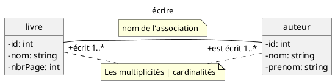

# Le Langage de modélisation UML

## Définition

> l'**UML** (**Unified Modeling Language**) est un langage graphique de modélisation objet conçu pour *représenter*, *spécifier*, *construire* et *documenter* un système d'information et qui peut se substituer à d'autres méthodes. 
C'est donc un "métalangage" fournissant des éléments permettant de construire le modèle de votre projet.
{.is-success}

> l'**UML** n'est pas une **méthode**
{.is-warning}

> Un **Modèle** est une représentation abstraite et simplifiée, d'une entité du monde réel en vue de le décrire, de l'expliquer ou de le prévoir
{.is-success}

Mais pourquoi modéliser ? 🤔 Je vous dirais que c'est une bien belle question 😁 et promis on va éviter le jargon compliqué, et on va essayer de rendre ça fun et accessible ;) !

Modéliser un système avant sa réalisation permet de mieux comprendre le fonctionnement du système. Il est connu par tous les membres de l'équipe et il est donc un vecteur privilégié pour communiquer 😉.

Quelques exemples de modèles : 

- Modèle Météorologique : permet de prévoir, à partir de données d'observation, les futurs conditions climatiques.

- Modèle Economomique : permet de simuler l'évolution de cours boursiers en fonction de certains facteurs (taux de croissance, % de chomage ...)

- Modèle démographique : définit la composition d’un panel d’une population et son comportement, dans le but de fiabiliser des études statistiques, etc.

## Historique 

Les premières méthodes d'analyse arrivent aux alentours des années 70 avec une découpe plutôt cartésienne (*fonctionnelle, structurée et hiérarchique*) d'un système.

Puis dans les années 80, l'approche systémique avec l'apparition de la méthode MERISE et les méthodes se rapprochent de ce qui se fait dans le monde réel, en particulier avec *les langages objets* qui apparraissent (C++).

Et enfin, dans les années 90, l'émergence et l'afflux des méthodes objet, avec une question : 
- Comment structurer un système sans centrer l'analyse uniquement sur les données ou uniquement sur les traitements (mais sur les deux) ? 

Trois grands noms de l'informatique : Grady Booch, James Rumbaugh et Ivar Jacobson ont essayés de répondre à cette question !

Plus de *50 méthodes objet* sont apparues durant cette période (Booch, Classe-Relation, Fusion, HOOD, OMT, OOA, OOD, OOM ...) sans pour autant qu'il y en ait une qui s'impose.

En 1994, une premier consensus, l'UML hérite de 3 méthodes  :
- OMT de James Rumbaugh : Vue statiques, dynamiques et fonctionnelles d'un système (R&D de General Electric)
- OOD de Grady Booch : Vue logiques et physiques du système
- OOSE d'Ivar Jacobson : couvre tout le cycle de développement (R&D d'Ericsson) en se reposant sur l'analyse des besoins utilisateurs

UML 1.0 est proposé et normalisé en janvier 1997 par l'OMG (Object Management Group)(Consortium de grandes entreprises avec Microsoft, IBM, Oracle, etc.). La dernière version, 2.5.1, date de décembre 2017 et comporte ainsi 14 types de diagrammes représentant autant de vues distinctes pour représenter des concepts particuliers du système d’information.
[https://www.omg.org/spec/UML/](https://www.omg.org/spec/UML/)

Alors, pourquoi est-ce que tu devrais t'intéresser à l'UML ? Tout simplement parce que c'est un outil super pratique pour mieux comprendre et communiquer sur les bases de données. Grâce aux diagrammes de classes de l'UML, tu peux visualiser la structure des données et des relations entre elles, ce qui peut être très utile pour la conception et le développement de bases de données. MAIS C'EST GENIAL !


## Les diagrammes UML

L'UML est un langage visuel permettant de créer des diagrammes définissant une application selon plusieurs points de vue, il en existe 14, voici un extrait : 

- **Vue Statique** (ou structurelles) :
	- diagramme de classe : *il représente les classes intervenant dans le
système.*
  - diagramme d'objets :  *il sert à représenter les instances de classes (objets) utilisées dans le système.*
  - ect ...
  <!-- diagramme de composants 
  - diagramme de déploiement 
  - diagramme de paquetage
  - diagramme de structures composites-->
- **Vue Dynamique (ou comportementales)** :
	- diagramme de cas d'utilisation : *il permet d'identifier les possibilités d'interaction entre le système et les acteurs (intervenants extérieurs au système), c'est-à-dire toutes les fonctionnalités que doit fournir le système*
  - diagrammes d'interaction
  	- diagramme de séquence : *représentation séquentielle du déroulement des traitements et des interactions entre les éléments du système et/ou de ses acteurs*
    - diagramme de communication : *représentation simplifiée d'un diagramme de séquence se concentrant sur les échanges de messages entre les objets.*
   <!-- - diagramme global d'intéraction
   	- diagramme de temps -->
    <!-- - diagramme d'activités
  - diagramme d'états-transitions -->
  - ect ...


Exemples : 

### Exemples {.tabset}
#### Diagramme de cas d'utilisation 
```plantuml

:Utilisateur: as A
:Administrateur: as B
A <|-- B

(Envoyer des courriels) as E
(Gérer les comptes) as G
(Authentification) as AU

A - E
B - G
E .> AU : include
G .> AU : include
```
#### Diagramme de classes
```plantuml

left to right direction
class Commandes  {
  date : string
  prepaye : boolean
  nombre : integer
  prix : float
  envoyer()
	terminer()
}

class Client {
   nom : string
   adresse : string
   montantCredit() : int
}

Commandes "*" -- "1" Client : Association

```

## UML pour les Bases de données

Très utilisé pour facilité la conception de documents nécessaires au développement de logiciel orienté objet, nous allons nous concentrer sur la création de BDD avec le langage UML.

Les données d'une BDD représentent des faits, des activités ou des évènements de l'entreprise. C'est une mémoire et de ce fait, elle doit être : 
- pertinente
- fiable
- cohérente
- utilisable

```plantuml

partition "Indépendant d'une SGBD" {
:Monde réel; 
-> Analyse;
:Spécifications de la BD;
-> Conception;
:Schéma conceptuel;
}
-> Transformation en modéle Logique;
partition "Lié à une  SGBD" {
:Schéma logique;
-> Conception Physique;
:Schéma interne;
}

```


### Objet

Vous avez l'habitude des objets, maintenant, un objet est caractérisé par plusieurs notions :
- Les attributs : Il s’agit des données caractérisant l’objet. Ce sont des variables stockant des informations sur l’état de l’objet.
- Les méthodes : Les méthodes d’un objet caractérisent son comportement, c’est-à-dire l’ensemble des actions (appelées opérations) que l’objet est à même de réaliser. Ces opérations permettent de 
	- faire réagir l’objet aux sollicitations extérieures, 
  - les opérations sont étroitement liées aux attributs,
- L’identité : L’objet possède une identité, qui permet de le distinguer des autres objets, indépendamment de son état.

La difficulté de la modélisation consiste à créer une représentation abstraite, sous forme d’objets, **d’entités** ayant une existence matérielle (chien, voiture, ampoule, personne, ...) ou bien virtuelle (client, temps, . . . ).

```plantuml
hide circle
skinparam classAttributeIconSize 0

note right of Livre: classe Livre
note top of Livre: nom de la classe (identifiant)
class Livre {
	-id: int
  -nom: string
  -nbrPage: int
  +getNom()
  +setNom(String nom)
  +getCouleur()
  +setCouleur(String couleur)
}

note left of Livre::nom
    attributs | propriétés | données membres
end note

note left of Livre::setNom
   méthodes | fonctions membres
end note
```

### Classe

Une classe est un type de données abstrait qui précise des caractéristiques
- attributs/propriétés 
- méthodes

communes à toute une famille d’objets. 
Elle permet de créer (instancier) des objets possédant ces caractéristiques.


### Diagramme de classes et d'objets

Le diagramme de classe permet de modéliser l'aspect statique des données d'un ensemble d'objets ainsi que leurs liasons (associations) entre eux.



- Un auteur écrit un ou plusieurs livres
- Un livre est écrit par un ou plusieurs auteurs

<!--### Atomicité des attributs

### Lien entre objets et associations entre classes

### Multiplicités (cardinalités)

### Schéma relationnel-->


